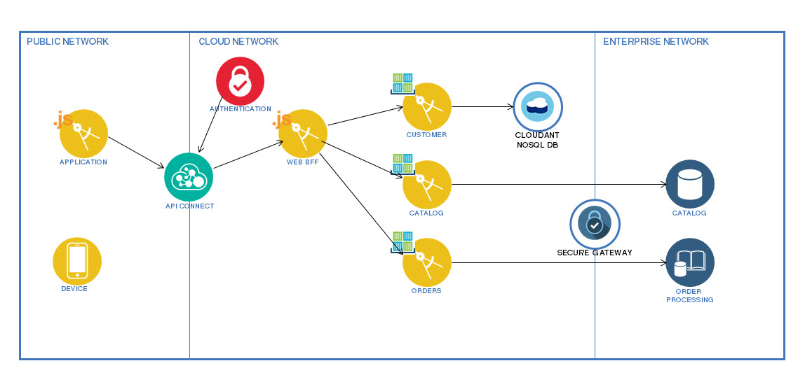

# BobbyCompute

This repository contains the code to implement Enablement sample reference application. The application is loosely based on the BlueCompute R3 application in `https://github.com/ibm-cloud-architecture/refarch-cloudnative`. However, instead of showing off the latest and greatest facility of Bluemix, the purpose of this application is for people to learn developing application in Bluemix. 

The application structure is depicted in the diagram below:

The implementation of the application can be performed as follows:

1. Install the back end environment that simulates on-premises resources:
    - Setup mysql database in a container as a Database of Record
    - Setup Order processing application that receive RESTful call as System of Record application
2. Define Bluemix services that are needed for the application:
    - Define secure gateway to act as the integration mechanism to the on-premises resources:
    - Define cloudant database for Customer microservice
3. Build the container groups that runs the microservices:
    - Customer application
    - Catalog application
    - Orders application
4. Deploy Web Backend-for-frontend as a Cloud Foundry application 
5. Deploy authentication application in a container
6. Deploy API Connect and publish the APIs
7. Deploy Web application

Before you start building your application, there are several steps that you must perform first:

- You must clone this repository to your local disk.

		git clone https://github.com/vbudi000/BobbyCompute

- Initialize the CLI environment 

		bx login
		bx ic init

- Quota requirement:
	- 2GB of container space (or 1GB container + 1GB shared env for backend)
	- .75GB of Cloud Foundry space
	- 3 Bluemix services

## MySQL setup

The MySQL is built as follows:

1. Go to the mysql directory:

		cd ~BobbyCompute/mysql

2. Build the container in Bluemix:
 
		bx ic build -t registry.ng.bluemix.net/$(bx ic namespace get)/mysql-${suffix} .

3. Run the container in Bluemix:
 
		bx ic run -m 512 --name mysql -p 3306:3306 -e MYSQL_ROOT_PASSWORD=Pass4Admin123 -e MYSQL_USER=dbuser -e MYSQL_PASSWORD=Pass4dbUs3R -e MYSQL_DATABASE=inventorydb registry.ng.bluemix.net/$(bx ic namespace get)/mysql-${suffix}
 
4. Associate an external IP address for the container (may not be needed with SecureGateway client)

		bx ic ip-request
		bx ic ip-bind <ipaddress> mysql-${suffix}

5. Run the load script.

		bx ic exec -t mysql-${suffix} bash

    And run the following:

		mysql -udbuser -p${DBPASS} < load-data.sql
		exit

## Order processing system setup

The order processing takes the order and save it in the orders table. It also substracts the available stock on the items database. 

The order processing receiving REST calls from external system. It is running as a Spring boot application on Jetty server. 

1. Go to the inventory sub-directory

		cd ~/BobbyCompute/inventory

2. Build the image for docker:

		./gradlew build
		./gradlew docker
		cd  docker
		bx ic build -t registry.ng.bluemix.net/$(bx ic namespace get)/backend-${suffix} .

3. Run the container:

		bx ic run -p 8080 -m 256 \
		  -e "spring.datasource.url=jdbc:mysql://<mysqlIP>:3306/inventorydb" \
		  -e "spring.datasource.username=dbuser" \
		  -e "spring.datasource.password=Pass4dbUs3R" \
		  registry.ng.bluemix.net/$(cf ic namespace get)/backend-${suffix}

4. Allocate an IP address for the container (may not needed with secure gateway client)

		bx ic ip-request
		bx ic ip-bind <ipaddress> backend-${suffix}

5. Check the implementation once the container group created completely:

		curl http://<backendip>:8080/micro/inventory/13401
		curl http://<backendip>:8080/micro/orders

## Secure Gateway setup

Build the secure gateway environment:

1. Provision Secure Gateway service and define the gateway and destination.

		cf create-service SecureGateway securegatewayplan sginstance
		authstr=`echo $userid:$password | base64`
		curl -k -X POST -H "Authorization: Basic $authstr" -H "Content-Type: application/json" -d "{\"desc\":\"IntegrationGateway\", \"enf_tok_sec\":false, \"token_exp\":0}" "https://sgmanager.ng.bluemix.net/v1/sgconfig?org_id=$orgid&space_id=$spaceid"

2. Provision a secure gateway client docker container in Bluemix.

		
3. Make sure that the secure gateway is active and get the destination mapping information. Create destinations for mysqlIP:3306 and backendIP:8080. Get the destination mappings.

 

## Cloudant NoSQL setup

Create the cloudant service in Bluemix and collect its credentials.

1. Create cloudant database as a service 

		bx service create cloudantNoSQLDB Lite refarch-cloudantdb-${suffix}
		bx service key-create refarch-cloudantdb-${suffix} cred
		bx service key-show refarch-cloudantdb-${suffix} cred

2. Collect the credential.

## Customer microservice setup

Build customer microservice in a container group.

1. Change directory to the customer  

		cd ~/BobbyCompute/customer

2. Build the application

		./gradlew build -x test
		./gradlew docker

3. Build the docker application

		cd  docker
		bx ic build -t registry.ng.bluemix.net/$(bx ic namespace get)/customer-${suffix} .

4. Run the application, remember to swap the appropriate Cloudant credential.

		bx ic group create -p 8080 -m 256  --desired 1 --max 1 --min 1 --auto --name customer-${suffix} \
		  -e "spring.application.cloudant.username=f0d330b4-5bda-4829-963c-6664a13a8ca9-bluemix" \
		  -e "spring.application.cloudant.password=f4cc3b9bce48f34026238f5bf11bee6933c17677542dcd2bda75c9926edce2a5" \
		  -e "spring.application.cloudant.host=f0d330b4-5bda-4829-963c-6664a13a8ca9-bluemix.cloudant.com" \
		  -e "spring.application.cloudant.port=443" \
		  -e "spring.application.cloudant.database=customers" \
		  -n customer-${suffix} \
		  -d mybluemix.net registry.ng.bluemix.net/${suffix}/customer-${suffix}

5. Test the application

		curl -X POST -H "Content-Type: application/json" -H "Accept: application/json" \
			-d '{"username": "foo", "password": "bar", "firstName": "foo", "lastName": "bar", "email": "foo@bar.com"}' \
			-i https://customerservice-${suffix}.mybluemix.net/micro/customer
		curl http://customer-${suffix}.mybluemix.net/micro/customer/search?username=foo
		curl -X GET -H "accept: application/json" -H "ibm-app-user: <custid>" http://customer-${suffix}.mybluemix.net/micro/customer

## Catalog microservice setup

Build catalog microservice in a container group.

1. Change directory to the Catalog

		cd ~/BobbyCompute/catalog

2. Build the application

		./gradlew build -x test
		./gradlew docker

3. Build the docker application

		cd  docker
		bx ic build -t registry.ng.bluemix.net/$(bx ic namespace get)/catalog-${suffix} .

4. Run the application, remember to swap the IP address of the mysql server.

		bx ic group create -p 8081 -m 256  --desired 1 --max 1 --min 1 --auto --name catalog-${suffix} \
		  -e "spring.datasource.url=jdbc:mysql://<mysqlIP>:3306/inventorydb" \
		  -e "spring.datasource.username=dbuser" \
		  -e "spring.datasource.password=Pass4dbUs3R" \
		  -n catalog-${suffix} \
		  -d mybluemix.net registry.ng.bluemix.net/${suffix}/catalog-${suffix}

5. Test the application

		curl http://catalog-${suffix}.mybluemix.net/micro/items/13401

## Orders microservice setup

Build orders microservice in a container group.

1. Change directory to the Orders 

		cd ~/BobbyCompute/orders

2. Build the application

		./gradlew build -x test
		./gradlew docker

3. Build the docker application

		cd  docker
		bx ic build -t registry.ng.bluemix.net/$(bx ic namespace get)/orders-${suffix} .

4. Run the application, remember to swap the appropriate IP address for your backend environment.

		bx ic group create -p 8083 -m 256  --desired 1 --max 1 --min 1 --auto --name orders-${suffix} \
		  -e "backend.host=<backendip>" \
		  -e "backend.port=8080" \
		  -n orders-${suffix} \
		  -d mybluemix.net registry.ng.bluemix.net/${suffix}/orders-${suffix}

5. Test the application

		curl http://orders-${suffix}.mybluemix.net/micro/orders

## Web BFF application setup

Customize and deploy the Web BFF node.JS application:

1. Change directory to the Web BFF 

		cd ~/BobbyCompute/web-bff
		
2. Edit the catalog, orders and customer routes in the routes subdirectory and specify the correct `microserviceBaseUrl` in all the files. 

		cd routes
		vi catalog.js
		vi customer.js
		vi orders.js

3. Edit the manifest file and change in the file the name and host parameters into `web-bff-<suffix>`:

		cd ..
		vi manifest.yml

4. Deploy the application

		bx app push

4. Test the BFF application

		curl http://web-bff-${suffix}.mybluemix.net/api/items/13401
		curl http://web-bff-${suffix}.mybluemix.net/api/orders
		curl http://web-bff-${suffix}.mybluemix.net/api/customer/search?username=foo

## Authentication application setup

Deploy the authentication application as a container group. This is necessary as OAuth2 is an authorization tool, __NOT__ an authentication tool. Similar to the API Connect implementation, it is for authorization (ie _Can I access ...?_); not authentication (ie _Are you ...?_) 

1. Change directory to the Authentication application 

		cd ~/BobbyCompute/auth

2. Build the application

		./gradlew build -x test
		./gradlew docker

3. Build the docker application

		cd  docker
		bx ic build -t registry.ng.bluemix.net/$(bx ic namespace get)/auth-${suffix} .

4. Run the application, remember to swap the appropriate Cloudant credential. (This application is not exactly a microservice as this share credential with the customer microservice, __TODO:__ to call the customer microservice without zuul from the authentication)

		bx ic group create -p 8085 -m 256  --desired 1 --max 1 --min 1 --auto --name auth-${suffix} \
		  -e "spring.application.cloudant.username=f0d330b4-5bda-4829-963c-6664a13a8ca9-bluemix" \
		  -e "spring.application.cloudant.password=f4cc3b9bce48f34026238f5bf11bee6933c17677542dcd2bda75c9926edce2a5" \
		  -e "spring.application.cloudant.host=f0d330b4-5bda-4829-963c-6664a13a8ca9-bluemix.cloudant.com" \
		  -e "spring.application.cloudant.port=443" \
		  -e "spring.application.cloudant.database=customers" \
		  -n auth-${suffix} \
		  -d mybluemix.net registry.ng.bluemix.net/${suffix}/auth-${suffix}
		
5. Test the authentication application

## Deploy API Connect and publish API

Deploy the API Connect service and publish the APIs for the oauth and BFF.

1. Change directory to the API directory 

		cd ~/BobbyCompute/api

2. Provision the API Connect service and define a BlueCompute catalog:

		bx service create APIConnect Essentials apic-refarch-${suffix}
		apic login -s us.apiconnect.ibmcloud.com -u vbudi@us.ibm.com -p <password> 
		org=`apic orgs -s us.apiconnect.ibmcloud.com`
		apic catalogs:create BlueCompute-${suffix} -s us.apiconnect.ibmcloud.com -o ${org} --name bluecompute-${suffix}
		apic config:set catalog=apic-catalog://us.apiconnect.ibmcloud.com/orgs/${org}/catalogs/bluecompute-${suffix}

4. Publish the oauth API to API Connect, change the URLs to `auth-<suffix>.mybluemix.net`.

		cd oauthProvider
		vi oauth-provider.yaml
		apic publish oauth-provider-product.yaml
		cd .. 

3. Update the Store-api files (catalog.yaml, customer.yaml, order.yaml) to refer to the BFF and authentication method and publish it to API Connect. 

		cd store-api
		vi catalog.yaml
		vi customer.yaml
		vi order.yaml
		apic publish store-api-product.yaml

5. Modify BlueCompute catalog to enable automatic subscription (to skip developer portal) - this step must be done using Web browser

	1. Login to `http://bluemix.net` 
	2. In the dashboard, click on `refarch-apiconnect-<suffix>` service
	3. Click __>>__ and select __Dashboard__
	4. Click on `BlueCompute-<suffix>` catalog
	5. Select __Settings__.
	6. Enable `Development mode` and `Automatic subscription`.
	7. Click the Save icon. 
	8. Click __Show__ to display the client ID. 

6. Use the client ID to test application (note that you can only test the catalog application as the other requires oauth authentication):

		curl -H "accept: application/json" -H "X-IBM-Client-id: <clientid>" https://api.us.apiconnect.ibmcloud.com/<orgname>/bluecompute-<suffix>/api/items/13401

	
## Deploy Web application

Deploy web application.

1. Change directory to the Web application 

		cd ~/BobbyCompute/web-app

2. Modify the config/default.json:
	- Application client-id: `<blue compute catalog client-id>`
	- API-Server org: `<org-name>`
	- API-Server catalog: `bluecompute-<suffix>` 

3. Modify manifest.yml and change in the file the name and host parameters into `web-app-<suffix>`:

		cd ..
		vi manifest.yml

4. Push the application to Bluemix

		bx app push

5. Test the application, go to `http://web-app-<suffix>.mybluemix.net`  