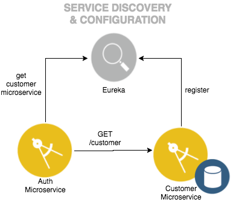

# Secure the API with OAuth 2.0 and authentication Service

*This project is part of the 'IBM Cloud Native Reference Architecture' suite, available at
https://github.com/ibm-cloud-architecture/refarch-cloudnative*

This project provides the artifact to authenticate the API user as well as enable OAuth 2.0 authorization for all OAuth protected APIs in the BlueCompute reference application. IBM API Connect OAuth provider delegates authentication and authorization to this component, which verifies credentials using the [Customer Microservice](https://github.com/ibm-cloud-architecture/refarch-cloudnative-micro-customer). The project contains the following components:

 - Spring Boot application that handles user authentication
 - Uses Spring Feign Client to get an instance of the Customer Microservice from Eureka registry and validate login credentials
 - Passes customer identity back to API Connect for identity propagation
 
The application uses API Connect OAuth 2.0 provider Public/Password grant type. For detail of how API Connect supports OAuth 2.0, please reference the IBM Redbook [Getting Started with IBM API Connect: Scenarios Guide](https://www.redbooks.ibm.com/redbooks.nsf/RedpieceAbstracts/redp5350.html?Open)

## Use Case

### Interaction with Identity Provider (Customer Microservice)



The Authentication microservice leverages the [Customer Microservice](https://github.com/ibm-cloud-architecture/refarch-cloudnative-micro-customer) as an identity provider.  
- When username/password is passed in, the Authentication microservice retrieves an instance of the Customer microservice using the [Service Registry](https://github.com/ibm-cloud-architecture/refarch-cloudnative-netflix-eureka) 
- Once an instance has been retrieved, Authentication microservices retrieves the Customer record by username.  
- `HTTP 200` is returned to indicate that the username/password are valid, `HTTP 401` is returned to indicate that the username/password is invalid.

### Interaction with API Gateway (API Connect)


The [API Gateway](https://github.com/ibm-cloud-architecture/refarch-cloudnative-api) (API Connect) leverages the Authentication microservice to perform authentication.  

- When a client wishes to acquire an OAuth token to call a protected API, it calls the OAuth Provider (API Connect) token endpoint with the username/password of the user.
- API Connect will call the Authentication microservice with the Authorization header containing Base64 encoded username and password.  
- The Authentication microservice calls the Customer Microservice to retrieve the username/password and perform the validation.
- If the username/password are valid, `HTTP 200` is returned, along with a response header, `Api-Authenticated-Credential` containing the unique user ID (i.e. customer ID) identifying the credentials.
- API Connect generates and returns a valid OAuth token for the client to call the protected APIs with.
  - API Connect passes the user identity downstream in another header `IBM-App-User` when calling the client calls the protected API with the OAuth token.

### Sequence


- When the client (Web or Mobile) wants to call a protected API, it must acquire a token.  It calls the API Connect OAuth Provider with the username/password credentials of the user.
- API Connect calls the authentication microservice with username and password credentials to validate.
- Authentication microservice calls the identity provider (Customer Microservice) to validate the username and password, which are stored in the Customer microservice data store.
- If username/password is valid, the authentication microservice returns `HTTP 200 OK` to API Connect, with the User Identity in the response header `Api-Authenticated-Credential`.
- API Connect generates an OAuth token corresponding to the user identity and returns it to the client in the response.
- When the client calls a protected API, the OAuth token is validated at API Connect.  If the token is valid, the User identity is passed downstream to the protected API in a header `IBM-App-User`.

# Prerequisites

- Docker installation
- [Eureka](https://github.com/ibm-cloud-architecture/refarch-cloudnative-netflix-eureka) 
- [Customer microservice](https://github.com/ibm-cloud-architecture/refarch-cloudnative-micro-customer)

# Deploy to BlueMix

You can use the following button to deploy the Authentication microservice to Bluemix, or you can follow the instructions manually below.

[](https://console.ng.bluemix.net/devops/setup/deploy?repository=https://github.com/ibm-cloud-architecture/refarch-cloudnative-auth.git)


# Deploy the Authentication Service:

In the sample application, the API Connect OAuth provider relies on the Authentication microservice to validate user credentials.  The Authentication service is deployed as a container group with a public route that connects to Eureka to 

## Build the Docker container

1. Build the application.  This builds both the WAR file for the Orders REST API and also the Spring Sidecar application:

   ```
   # ./gradlew build
   ```

2. Copy the binaries to the docker container
   
   ```
   # ./gradlew docker
   ```

3. Build the docker container
   ```
   # cd docker
   # docker build -t auth-microservice .
   ```

## Run the Docker container locally (optional)

Execute the following to run the Docker container locally.  Note that you require a local [Eureka](https://github.com/ibm-cloud-architecture/refarch-cloudnative-netflix-eureka) instance and a local [Customer microservice](https://github.com/ibm-cloud-architecture/refarch-cloudnative-micro-customer).  Be sure to replace `<Eureka URL>` with the URL for Eureka.  

Note that the authentication microservice does not register with Eureka (`eureka.client.registerWithEureka=false`) but fetches the registery (`eureka.client.fetchRegistry=true`)

```
# docker run -d --name auth-microservice -P \
  -e eureka.client.fetchRegistry=true \
  -e eureka.client.registerWithEureka=false \
  -e eureka.client.serviceUrl.defaultZone=<Eureka URL> \
  auth-microservice
```

## Validate the (local) Authentication service (optional)

For a user `foo` with password `bar`, get the authentication string:

```
# echo -n "foo:bar" | base64 
Zm9vOmJhcg==
```

Use this string to pass in the authorization header:

```
curl -i -H "Authorization: Basic Zm9vOmJhcg==" http://localhost:8080/authenticate
```

## Deploy the container group on Bluemix

1. Tag and push the auth-microservice to Bluemix:
   ```
   # docker tag auth-microservice registry.ng.bluemix.net/$(cf ic namespace get)/auth-microservice
   # docker push registry.ng.bluemix.net/$(cf ic namespace get)/auth-microservice
   ```

2. Deploy the container group on Bluemix

   Be sure to replace `<Eureka URL>` with the URL for Eureka.  Note the `name` passed to the command, a public route will be mapped to the container group.

   ```
   # cf ic group create \
     --name auth-microservice \
     --publish 8080 \
     -e eureka.client.fetchRegistry=true \
     -e eureka.client.registerWithEureka=false \
     -e eureka.client.serviceUrl.defaultZone=<Eureka URL> \
     --desired 1 \
     --min 1 \
     --max 3 \
     registry.ng.bluemix.net/$(cf ic namespace get)/auth-microservice
   ```

## Validate the Authentication service on Bluemix

For a user `foo` with password `bar`, get the authentication string:

```
# echo -n "foo:bar" | base64 
Zm9vOmJhcg==
```

Use this string to pass in the authorization header.  This command should return HTTP 200 which indicates the authentication was successful.

```
curl -i -H "Authorization: Basic Zm9vOmJhcg==" https://auth-microservice.mybluemix.net/authenticate
HTTP/1.1 200 OK
X-Backside-Transport: OK OK
Connection: Keep-Alive
Transfer-Encoding: chunked
Api-Authenticated-Credential: edb8ace38d9749e5863ba905bd806f9c
Date: Tue, 14 Feb 2017 21:43:08 GMT
Server: Jetty(9.2.13.v20150730)
X-Application-Context: auth-microservice:8080
X-Vcap-Request-Id: f49bdae7-0d66-4a5f-6f45-37c66ede7382
X-Client-IP: 174.115.37.120
X-Global-Transaction-ID: 757825297
```

Note that it should return the ID of the user in the response header `Api-Authenticated-Credential`.
